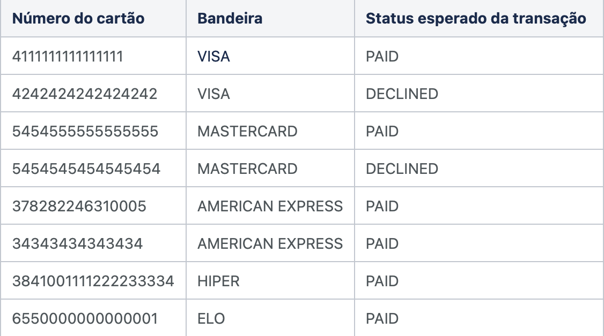

## Como simular um pagamento em Sandbox

Para simular pagamentos é necessário antes cadastrar pedidos utilizando o SDK ou order-api. 
Caso o pedido tenha sido cadastrado realizado pelo SDK, obtido através do objeto de response no campo "paymentLink". Observando o caso abaixo, o valor seria "11111111-2222-3333-4444-555555555555". 


```xml
"paymentLink": "https://pagseguro.uol.com.br/para-seu-negocio/aplicativos/minha-conta/download?f=order&r=11111111-2222-3333-4444-555555555555"
```


 Se o pedido foi cadastrado através do Order-api, o retorno estará disponível no campo "url" do array "deepLink", conforme a seguir:


```xml
"deep_links": [
    {
        "url": "https://pagseguro.uol.com.br/para-seu-negocio/aplicativos/minha-conta/download?f=order&r=11111111-2222-3333-4444-555555555555",
        "amount": {
            "value": 101
        }
    }
]
```


* #### Balance (saldo em conta)

Com o pedido criado, acessar o enpoint  de simulação de pagamento com Saldo conforme o cURL abaixo :
___
## ATENÇÃO: no ambiente de simulação, os pedidos deverão ter valor entre R$ 1,00 e R$ 1.500,00
___

```xml
curl --location --request POST 'https://sandbox.sdk.pagseguro.com/pagpay/balance/{id-requisicao}' \
--header 'accept: application/json' \
--header 'Content-Type: application/json' \
--data-raw '{
    "status":"{status-desejado}"
}'
```


Para essa requisição, os parâmetros são:

• {status-desejado} - Informar "PAID" caso queira simular um pagamento com sucesso ou "DECLINED" para um pagamento rejeitado. 
• {id-requisicao} - ID recebido cadastrar ao pedido via SDK ou order-api.   


* #### Credit Card (Cartões de crédito da carteira)

Com o pedido criado, acessar o endpoint  de simulação de pagamento com Cartão de crédito conforme o cURL abaixo:

___
## ATENÇÃO: os números dos cartões informados devem conter na lista de cartões aqui documentados. Cada cartão representa um status da transação de confirmação de pagamento
___

```xml
curl --location --request POST 'https://sandbox.sdk.pagseguro.com/pagpay/credit-card/{id-requisicao}' \
--header 'Content-Type: application/json' \
--data-raw '{
    "card_number": "{cartao_desejado}"
}'
```


Para essa requisição, os parâmetros são: 

• {cartao_desejado} - Informar o número do cartão conforme retorno desejado:



• {id-requisicao} - ID recebido cadastrar ao pedido via SDK ou order-api.


* Retornos para simulação de pagamento SUCESSO:

• Para status "PAID":

```xml
"PAID"
```

• Para status "DECLINED":

```xml
"DECLINED"
```

• Para ambos status, o fluxo de webhooks de pagamentos é acionado. Para maiores detalhes sobre o funcionamento podem ser vistos [nessa documentação](https://documenter.getpostman.com/view/10863174/TVetc6HV#209355ec-a9d4-4228-8c6d-81e0db11002a)

___
### Tratamento de erros simulação de pagamento
Em caso de falhas no envio da requisição ou no processamento da mesma, é possível receber um código de erro 4XX ou 5XX com o seguinte payload:


```xml
{
    "errors": [
        {
            "code": "<Código de erro>",
            "message": "<Mensagem do erro>"
        }
    ]
}
```


